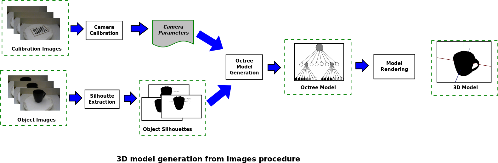

## Software demo
Take a look at the following video to see what 3Dorfi can do.

## Description

The source code of this repository was developed for a project based computer science master course. The project consisted on developing a software application capable of generating 3D models of physical objects from a series of images taken from different angles. The main algorithm of this application was implemented using the technique presented in this paper: [Rapid Octree Construction from Image Sequences](https://pdfs.semanticscholar.org/6b04/58ebe30555ebebc31e85f85845fef2be17f4.pdf). The image above shows the general procedure followed by the software to generate 3D models of objects. First, calibration and object images are taken from a camera and stored in the application. Then, camera calibration parameters and object silhouettes are computed. Next, using the camera parameters and silhouettes, an octree model is generated. Finally, the octree model is rendered. This application was deloveped using Java 8, JavaFX, and OpenCV.

## Calibration and object images

In order to generate the 3D model of an object, several images are taken at different angles and loaded to the application. In addition, for each image of the object, a calibration image is taken at the same angle. This calibration images are used to extract measures (angles and distances) that are used by the octree model generation algorithm to compute a 3D model. The figure below shows pairs of objects and calibration images taken at different angles (0, 60, and 120 degrees). For this project, a turntable was used to facilitate the image acquisition procedure. 

## Camera Calibration

During the octree model generation procedure, voxels corresponding to elements of the octree are projected from a 3D space to a 2D space. In order to perform the projections, a projection matrix composed of intrinsic and extrinsic parameters is used. These parameters can be computed using calibration images. For this project, the intrinsic parameters (focal length, optical center, and skew coefficients) were computed using a chessboard pattern and the [MATLAB calibration app](https://www.mathworks.com/help/vision/ref/cameracalibrator-app.html). These parameters only need to be computed once. Thus, once they were computed, they were stored in the configuration parameters of the application. On the other hand, the extrinsic parameters (rotation and translation vectors) depend on the position of the camera with respect to the object of interest. Because the orientation of the object changes on each image, a calibration image is used for each object image. The extrinsic parameters corresponding to an image are computed using the intrinsic parameters and OpenCV. Once intrinsic and extrinsic parameters are computed, projection matrices are computed and assigned to each of the object images to be used later during the octree model generation procedure.

For a more in depth explanation about camera parameters and their computation, take a look at the following resources:
* [Camera calibration with OpenCV.](https://docs.opencv.org/3.3.1/d4/d94/tutorial_camera_calibration.html)
* [Lecture slides from section: 8. Multi-View Geometry.](http://www.cs.cmu.edu/~16385/s17/)
* [MatWorks camera calibration tutorial.](https://www.mathworks.com/help/vision/ug/camera-calibration.html)

## Silhouette extraction
The octree model generation algorithm uses binary silhouettes to create 3D models of objects. During the development of this application, several silhouette extraction algorithms were tried. In the end, the following procedure was chosen:

1. Convert an object image to grayscale and apply a simple binarization method using an appropriate threshold.
2. Remove noise from the binary image using a combination of morphological image processing techniques.
3. Compute connected components on the binary image and delete pixels that are not connected to elements close to the center of the image. This procedure removes elements that are considered important by the binarization method but are not part of the object of interest.

When the default threshold value does not produce good silhouettes, this value can be adjusted in the **Silhouettes Config Tab** of the application.

## Octree Model Generation
This part of the process is responsible for generating the octree data structure that represents a 3D model of a physical object. The camera parameters and object silhouettes previously computed are used as inputs to the model generation algorithm. Overall, the octree model generation algorithm works as follows:

1. Create an initial octree with three levels of depth assigning a black color to all of its internal nodes and leafs.
2. Using the computed camera parameters, for a given silhouette, project each black leaf into a 2D image and compute a bounding box.
3. Using the bounding box and the silhouette, change the color of the leaf using the following rules:
 * Assign a white color if the bounding box is outside of the silhouette.
 * Assign a gray color if the bounding box is partially inside the silhouette and the previous color is black or gray.
 * Keep the current color if the bounding box is completely inside the silhouette.
4. Repeat steps 2 and 3 for the remaining silhouettes.
5. Recursively divide the gray leafs creating eight internal nodes with black leafs and go back to step 2 until the maximum depth level is reached.

For a more detailed description of this procedure, read the following article: [Rapid Octree Construction from Image Sequences](https://pdfs.semanticscholar.org/6b04/58ebe30555ebebc31e85f85845fef2be17f4.pdf)

## Model Rendering

Once the octree model is computed, a simple 3D engine written using the JavaFX 3D libraries is used to allow users to view and interact with the 3D model. This model is rendered using Voxels, which makes models look a bit like minecraft objects. However, by selecting an appropriate number of resolution levels, the models appearance improves. The maximum number of resolution levels corresponds to the maximum depth of the computed octree. The figures below show a cup displayed at different resolution levels. Notice how the shape looks more realistic as the number of levels is increased.  

In addition to selecting the number of resolution levels, it is also possible to select the way voxels are rendered. Below you can see how a model can be displayed only using black voxels, using black and gray voxels, using transparent voxels with colored edges for black and grey voxels, and using random colors for black voxels.

# How to run this project
## Install project dependencies
First, you have to install the following dependencies:

1. Install the Java SE Development Kit 8 from this webpage: https://docs.oracle.com/javase/8/docs/technotes/guides/install/install_overview.html.
2. Install the appropriate Eclipse IDE for Java developers for your operative system: https://www.eclipse.org/downloads/packages/installer
3. Install OpenCV for Java: https://opencv-java-tutorials.readthedocs.io/en/latest/01-installing-opencv-for-java.html#introduction-to-opencv-for-java.
4. Clone the following repository: https://github.com/jacordero/3dorfi.git.

## Configure project (eclipse)
After you have the required dependencies installed, load and compile the application's source code using the Eclipse IDE.

1. Open the Eclipse IDE and import the *3dorfi/ObjectReconstructor* folder as a project. The import projects tab is enabled by selecting the following options: *File* > *Import* > *General* > *Existing projects into workspace*.
2. Select *ObjectReconstructor* as the root directory of the project and click Finish.

After the project is loaded, the OpenCV library must be added to the project build path. This can be done as follows:
1. Open the Java Build Path window by doing: *Right click on the project* > *Build Path* > *Configure Build Path*.
2. Click on *Add External JARs* (*Libraries* tab) and select the location of the opencv-3xx.jar file.
3. Update the *Native library location* of the opencv-3xx.jar file.
4. Click *OK* to finalize the configuration.

## Run examples
To play around with examples, first run the *nl.tue.vc.application.ObjectReconstructor.java* as a Java application, and then follow the next steps:

1. Enable the **Select 3D Test Model** button.
2. Trom the dropdown menu next to the checkbox button, select one of the following options: **Charger**, **Cup** or **Hexagon**.
3. Click the **Generate 3D Test Model** button.

