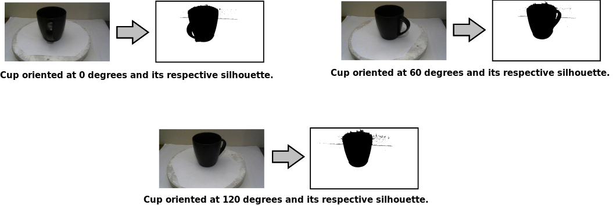

# Description

This repository contains the source code of a software application developed for computer science master course. This application is able to generate 3D models of physical objects from a series of images taken from different angles. The image below shows the general procedure followed by the software. First, calibration and object images are taken from a camera and stored in the application. Then, calibration parameters and object silhouettes are computed. Next, using the previously computed parameters and silhouettes, an octree model is generated. Finally, the octree model is rendered at different resolution levels and using different display options. This application uses Java 8, JavaFX, and OpenCV.

## Calibration and object images

In order to generate a 3D model of an object, several images taken at different angles are used by application. To generate good 3D models, the octree model generation algorithm needs to extract measures (angles and distances) of the real world from the images. That is for each object image a corresponding calibration image is taken. These calibration images must be taken at the same angle as the object image. The figure below shows pairs of objects and calibration images taken at different angles (0, 60, and 120 degrees). For this project, a turntable was used to facilitate the image acquisition procedure. 

## Camera Calibration

The camera calibration procedure uses calibration images to compute camera parameters of the images. The are two types of camera parameters: intrinsic parameters and extrinsic parameters. From these parameters, a projection matrix can be computed which can be used to map real world coordinates to pixel coordinates and the other way around. The intrinsic parameters contain: 

For a more in depth explanation about camera parameters, look at the following resources:
* [https://docs.opencv.org/3.3.1/d4/d94/tutorial_camera_calibration.html](Camera calibration with OpenCV)
* [http://www.cs.cmu.edu/~16385/s17/] (Lecture slides from section: 8. Multi-View Geometry)
* [https://www.mathworks.com/help/vision/ug/camera-calibration.html] (MatWorks camera calibration tutorial)

## Silhouette extraction
The octree model generation algorithm uses silhouettes to create the 3D model of the object. Several silhouette extraction algorithms were tried during the development of this project. In the end, the following procedure was chosen:

1. Convert the object image to grayscale and apply a simple binarization method using an appropriate threshold.
2. Remove noise from the binary image using a combination of morphological image processing techniques.
3. Compute connected components on the binary image and delete elements that are not connected to elements in the center of the image. This procedure removes elements that were considered important by the thresholding binarization procedure but are not part of the object of interest.

In case the default threshold value does not produce good silhouettes, this value can be adjusted in the **Silhouettes Config Tab** of the application.

## Octree Model Generation

## Model Rendering

# How to run this project
## Install project dependencies
The following instructions explain how to install the project dependencies.

1. Install the Java SE Development Kit 8 following this webpage's instructions: https://docs.oracle.com/javase/8/docs/technotes/guides/install/install_overview.html.

2. Install the appropriate Eclipse IDE for Java developers according to your operative system. Instructions for installing Eclipse can be found in the following URL: https://www.eclipse.org/downloads/packages/installer
3. Install OpenCV for Java following this webpage's instructions: https://opencv-java-tutorials.readthedocs.io/en/latest/01-installing-opencv-for-java.html#introduction-to-opencv-for-java.

4. Using git, clone the following repository https://github.com/jacordero/3dorfi.git.

## Configure project (eclipse)
The following instructions explain how to load and compile the source code of the application using the Eclipse IDE.

First, open the Eclipse IDE and import the *3dorfi/ObjectReconstructor* folder as a project. The import projects tab is enabled by selecting the following options: File > Import > General > Existing projects into workspace. Then, select *ObjectReconstructor* as the root directory of the project and click Finish.

After the project is loaded, the project's build path is configured to add the previously built OpenCV library. To open the Java Build Path window do: Right click on the project > Build Path > Configure Build Path. In the *Libraries* tab click on *Add External JARs* and select the location of the opencv-3xx.jar file. Then, update the *Native library location* of the opencv-3xx.jar file. Finally, click *OK* to finalize the configuration.

## Run examples
To use the application, run the *nl.tue.vc.application.ObjectReconstructor.java* as a Java application. To see examples of 3D models, first enable the **Select 3D Test Model** button, then select **Charger**, **Cup** or **Hexagon** from the dropdown menu next to the checkbox button, and finally click the "Generate 3D Test Model" button.

